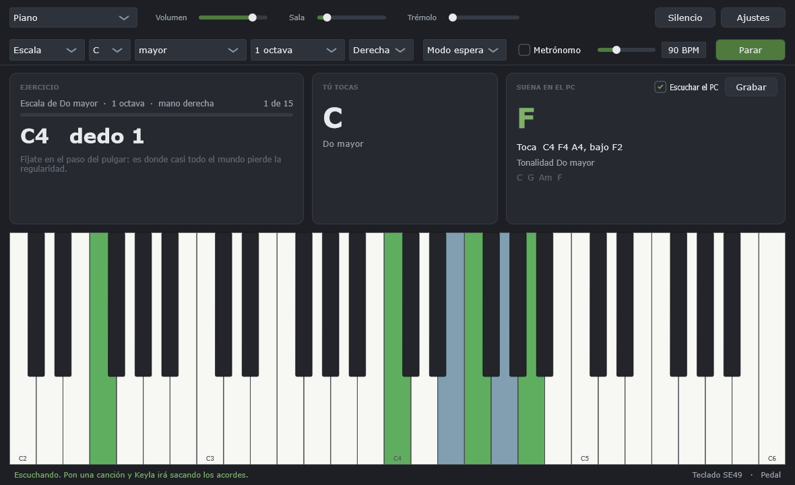

# Keyla

Aplicación de escritorio para Windows para aprender piano con un teclado MIDI.
Independiente: sin DAW, sin plugins, sin suscripción. Instrumento y profesor en
el mismo programa.



Keyla hace tres cosas:

- **Suena.** Once instrumentos sintetizados, con 7,5 ms de latencia medidos de
  la tecla al oído y cero cortes en diez minutos.
- **Enseña.** Escalas, arpegios y progresiones en cualquier tonalidad, en modo
  espera (no avanza hasta que aciertas) o a tempo con metrónomo, y un informe
  al final sobre tu ritmo.
- **Escucha.** Pon una canción en el ordenador y Keyla saca los acordes, la
  tonalidad, y te enciende en pantalla las teclas para acompañarla.

## Probarlo

Necesitas **Windows 10 u 11 de 64 bits**. Un teclado MIDI si quieres tocar de
verdad, pero **no hace falta para probarlo**: el teclado de la pantalla suena
con el ratón.

Descarga el ZIP de la sección [Releases](../../releases), descomprímelo y abre
`Keyla.exe`. No hay instalador ni hace falta nada más: es un único ejecutable
que sólo usa librerías de Windows.

> **Windows va a avisarte de que no reconoce la aplicación.** Es lo que le pasa
> a cualquier programa sin firma digital, que cuesta unos cientos de euros al
> año. Pulsa *Más información* → *Ejecutar de todas formas*. Si tienes activado
> *Control inteligente de aplicaciones*, lo bloqueará sin dar opción, y ahí no
> hay truco: o lo desactivas —es irreversible sin reinstalar Windows— o
> compilas tú el programa.

La primera vez, si el sonido no sale por donde esperas, mira **Ajustes**: la
salida de audio y la entrada MIDI se eligen ahí.

## Compilar

Hace falta CMake ≥ 3.22 y MSVC (las *Build Tools* de Visual Studio bastan).
JUCE se descarga solo la primera vez.

```
cmake -S . -B build
cmake --build build --config Release --target keyla
```

El ejecutable sale en `build/src/app/keyla_artefacts/Release/Keyla.exe`.
**Siempre en Release**: en Debug las cifras de CPU no significan nada.

Los tests no necesitan tarjeta de sonido ni teclado:

```
cmake --build build --config Release --target keyla_tests
build/bin/Release/keyla_tests.exe
```

## Cómo está hecho

```
src/core/    todo lo que es música y medida. Sin UI, sin dispositivos, testeable
src/app/     la ventana, WASAPI y MIDI. Lo único que toca el hardware
src/tools/   utilidades de consola: medir latencia, analizar grabaciones, ...
tests/       152 casos, sin hardware
docs/        el diseño y por qué está así
```

La separación no es decorativa: **una regla de compilación falla si `core/`
llega a depender de la interfaz o de los dispositivos**. Eso es lo que permite
que casi todo el proyecto se pruebe sin enchufar nada.

Hay diez invariantes de arquitectura —el hilo de audio no reserva memoria ni
toma locks, el reloj de audio manda sobre todo lo demás, la evaluación es una
función pura sobre grabaciones— explicados en
[CLAUDE.md](CLAUDE.md) y en [`docs/`](docs/). Si algo parece retorcido, lo más
probable es que sea por uno de ellos, y ahí está el motivo escrito.

Herramientas que igual te sirven:

| Herramienta | Para qué |
|---|---|
| `audio_probe` | Mide latencia, dropouts, CPU y jitter MIDI de tu equipo |
| `keyla_session` | Analiza una grabación de escucha y prueba cientos de ajustes del reconocedor |
| `keyla_snapshot` | Dibuja la ventana en un PNG sin abrirla, para diseñar mirando |

## Aportar

Bienvenido. Un par de cosas que ahorran tiempo:

- **Los tests están para cazar errores reales, no para hacer bulto.** Cada uno
  guarda un fallo que ya ocurrió: un trémolo que desaparecía al sumarse a mono,
  una cuerda desafinada 13 cents, un bajo fantasma inventado a partir de la voz.
  Si tocas el reconocimiento de acordes, corre `keyla_tests` antes y después.
- **Nada es específico de un teclado concreto.** Debe funcionar con cualquier
  controlador MIDI.
- Comentarios y documentación en castellano; nombres de código en inglés.

Lo que falta y en qué orden lo haría: el final de
[CLAUDE.md](CLAUDE.md#lo-que-falta-para-cerrar-de-verdad).

## Licencia

MIT — ver [LICENSE](LICENSE). Úsalo, cópialo y modifícalo con libertad.
